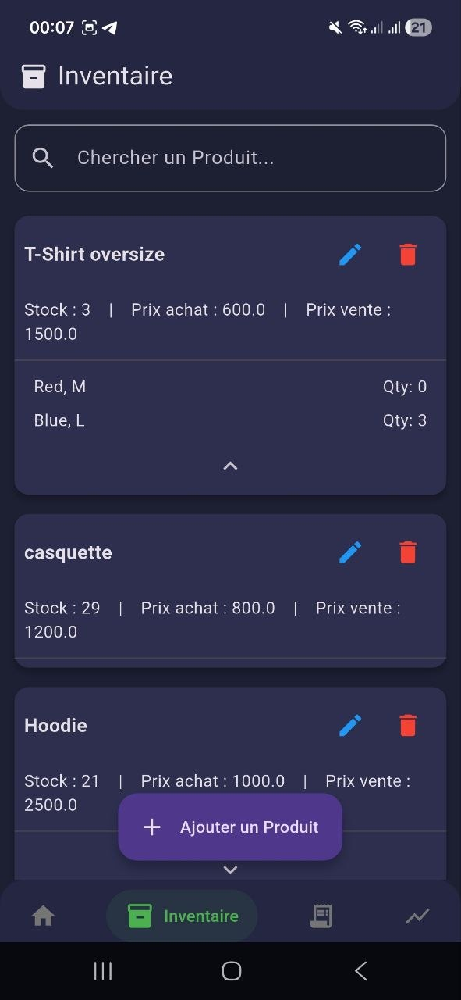
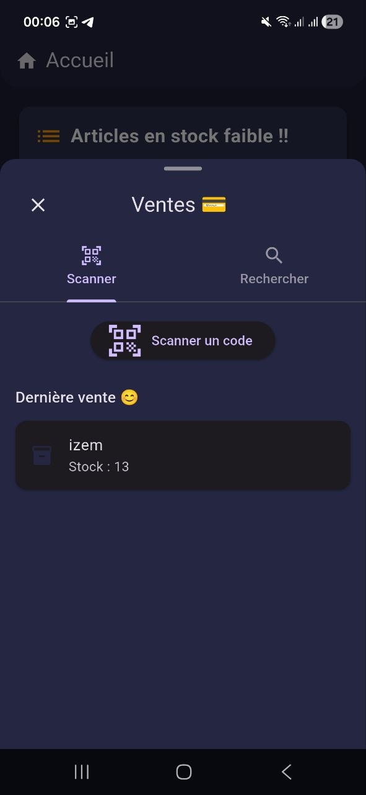
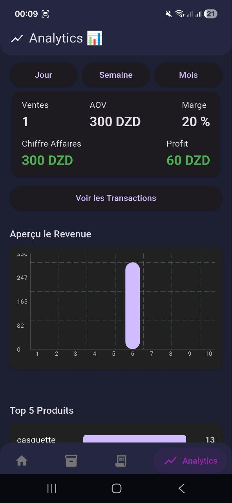
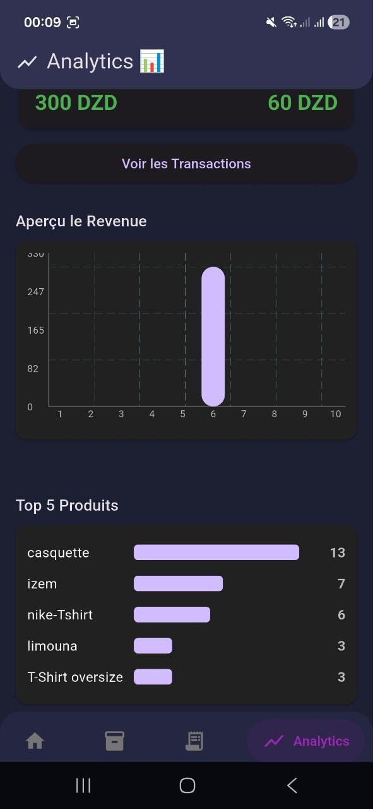
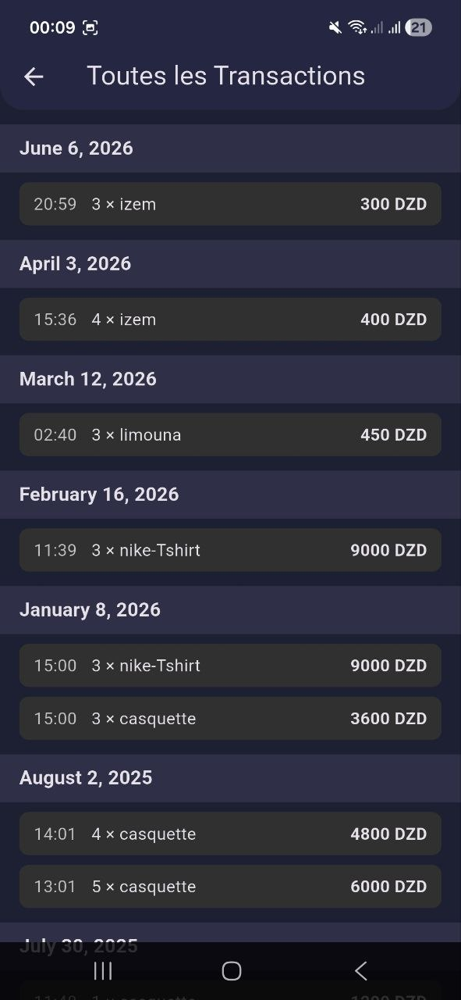

# Stocky

> A mobile inventory and sales management solution designed for small businesses.

Stocky transforms a smartphone into a complete inventory management system, allowing business owners to manage products, track stock levels, process sales, monitor performance, and make data-driven decisions from a single application.

---

## Overview

Many small businesses still rely on notebooks, spreadsheets, or expensive POS systems to manage their inventory.

Stocky provides an affordable and mobile-first alternative by combining inventory management, QR code integration, sales tracking, procurement workflows, and business analytics into a single application.

The goal is simple:

**Help business owners spend less time managing stock and more time growing their business.**

---

## The Problem

Managing inventory manually often leads to:

* Stock shortages
* Inventory inaccuracies
* Poor sales visibility
* Difficult restocking decisions
* Lack of business insights

Traditional POS solutions can also be expensive and require dedicated hardware.

---

## The Solution

Stocky turns a mobile phone into a complete inventory management platform.

Users can:

* Digitize their inventory
* Manage simple and variable products
* Generate and scan QR codes
* Record sales instantly
* Monitor inventory levels
* Track sales performance
* Analyze business metrics through interactive dashboards

---

## Key Features

### Inventory Management

* Add, edit, and remove products
* Track stock quantities
* Search products instantly
* Organize products efficiently

### Product Variants

Support for both:

* Simple products
* Variable products

Examples:

* T-shirts with multiple sizes and colors
* Shoes with different sizes
* Products with configurable attributes

### QR Code Integration

* Generate QR codes for custom products
* Scan existing product codes
* Accelerate product lookup and sales operations

### Restock Management

* Create restock lists
* Track pending purchases
* Update inventory with a single action

### Sales Tracking

* Record transactions
* Track quantities sold
* Maintain complete sales history

### Analytics Dashboard

* Revenue tracking
* Profit analysis
* Margin calculation
* Average Order Value (AOV)
* Top-selling products
* Performance trends

---

## Engineering Highlights

* Object-Oriented Design (OOP)
* Modular system architecture
* Abstract product hierarchy
* Product variant modeling
* QR code integration
* Transaction history management
* Analytics processing engine
* Mobile-first user experience

---

## Technology Stack

### Mobile Development

* Java
* Android SDK

### Data Storage

* SQLite

### Software Engineering

* UML Modeling
* Object-Oriented Programming
* Design Patterns
* Domain-Driven Modeling

---

## Screenshots

### Inventory Management

  

### Sales Operations

  

### Analytics Dashboard

  
  

### Sales History

  

---

## UML Documentation

The system was modeled using UML to represent its major functional domains.

### Included Diagrams

* Use Case Diagram
* Core System & Authentication Module
* Catalog & Product Management Module
* Procurement & Restock Module
* Sales & Analytics Module
* Sales Workflow Sequence Diagram

Explore the full documentation in the UML folder.

---

## Future Improvements

* Multi-store management
* Cloud synchronization
* Supplier management
* Expense tracking
* Real-time notifications
* Multi-user collaboration
* Advanced reporting
* AI-assisted inventory forecasting

---

## Author

Badr

Computer Science Student

Areas of Interest:

* Software Engineering
* Mobile Development
* System Design
* Inventory Systems
* Fintech Solutions
