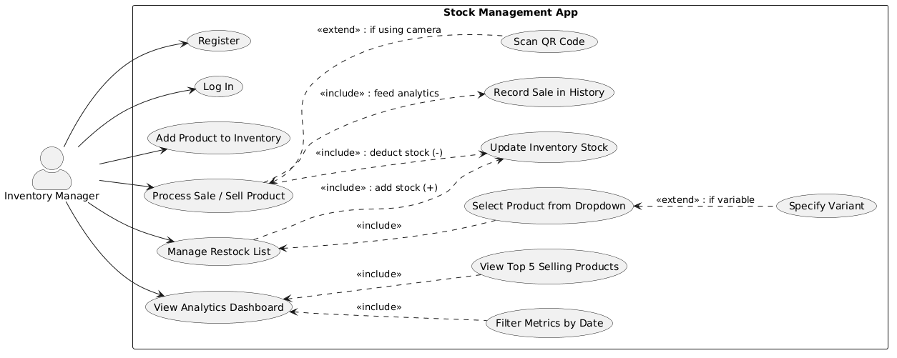
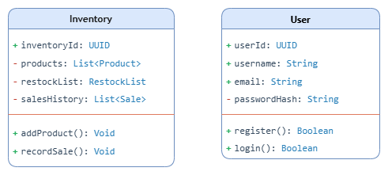
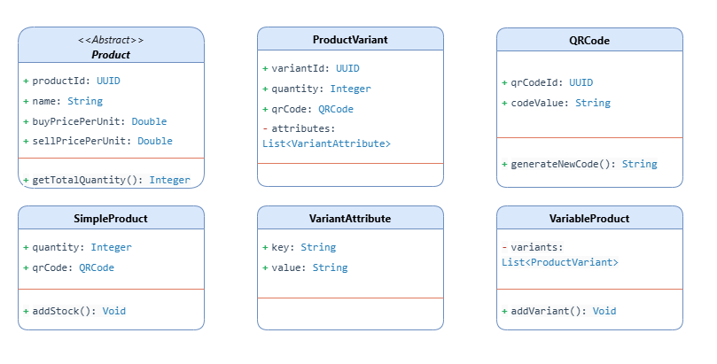
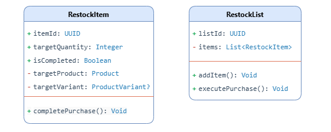
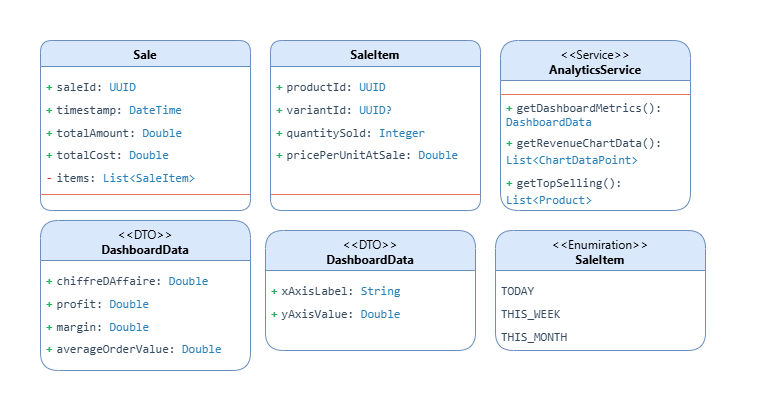

# UML Documentation

This section presents the UML models used during the design of the Stocky system.

The objective of these diagrams is to represent the business domain, identify the major entities involved in inventory management, and model the interactions between users and the application.

---

# Use Case Diagram

The use case diagram provides a high-level view of the interactions between the store owner and the application.

Core functionalities include:

* Product management
* Inventory management
* QR code operations
* Restock management
* Sales registration
* Sales history consultation
* Analytics dashboard access

The Store Owner acts as the primary actor and interacts with all operational modules of the system.

---

# Core System & Authentication Module

## Purpose

This module manages user access and workspace isolation.

Each user operates within their own inventory environment, ensuring complete separation between business datasets.

## Main Classes

### User

Responsible for:

* Registration
* Authentication
* Identity management

### Inventory

Acts as the user's private workspace and central data container.

The inventory maintains:

* Product catalog
* Restock lists
* Sales history

This design ensures that all business operations remain linked to a specific user account.

---

# Catalog & Product Management Module

## Purpose

This module represents the heart of the Stocky system.

It was designed to support both simple products and complex products with multiple variations.

---

## Product Hierarchy

The system uses an abstract Product class to define the common attributes shared by all products.

Two specialized implementations extend this base model:

### SimpleProduct

Represents products with a single stock quantity.

Examples:

* Notebook
* Mug
* Water bottle

### VariableProduct

Represents products that exist in multiple variations.

Examples:

* T-Shirts
* Shoes
* Clothing
* Electronics with multiple configurations

---

## Variant Modeling

One of the key strengths of the Stocky architecture is its support for product variants.

Instead of storing all stock under a single product quantity, each variation is modeled independently through:

### ProductVariant

Stores:

* Quantity
* Individual stock level
* Variant identity

### VariantAttribute

Defines the characteristics of a variant such as:

* Size
* Color
* Capacity
* Model

Example:

T-Shirt

├── Red / Small
├── Red / Medium
├── Blue / Small
└── Blue / Medium

Each variation maintains its own inventory quantity and lifecycle.

This approach provides significantly greater flexibility than traditional inventory systems and more accurately reflects real-world retail operations.

---

## QR Code Integration

The system integrates QR technology through the QRCode class.

Capabilities include:

* QR code generation
* QR code scanning
* Product identification
* Fast product retrieval

This feature accelerates inventory operations and simplifies the sales process.

---

# Procurement & Restock Module

## Purpose

This module manages the replenishment cycle of the inventory.

It enables users to maintain purchasing plans and update stock levels efficiently.

---

## Main Classes

### RestockList

Maintains the collection of products that need to be purchased.

### RestockItem

Acts as the bridge between:

* Product
* ProductVariant
* Desired purchase quantity

---

## Workflow

The user selects a product from the catalog and adds it to the restock list.

Once the physical purchase is completed, a single action automatically:

1. Marks the item as purchased
2. Updates inventory quantities
3. Synchronizes stock levels

This design minimizes manual inventory adjustments.

---

# Sales & Analytics Module

## Purpose

This module records business activity and transforms raw sales data into actionable insights.

---

## Sales Tracking

The sales subsystem records:

* Product sold
* Quantity sold
* Sale date
* Sale value

Main classes:

### Sale

Represents a completed transaction.

### SaleItem

Represents individual products contained within a transaction.

This separation allows a single sale to contain multiple products.

---

## Analytics Engine

The AnalyticsService class acts as the processing engine of the platform.

Responsibilities include:

* Revenue calculation
* Profit calculation
* Margin analysis
* Average Order Value (AOV)
* Time-based filtering

Supported periods:

* Today
* This Week
* This Month

---

## Dashboard Data Transfer Objects

To improve separation between business logic and user interface rendering, the system uses DTOs:

### DashboardData

Contains aggregated KPIs.

### ChartDataPoint

Contains chart-ready time-series data.

This design keeps the analytics layer independent from the mobile UI.

---

# Sales Workflow Sequence Diagram

The sequence diagram illustrates the complete lifecycle of a sales operation.

---

| Step | Action                                 |
| ---- | -------------------------------------- |
| 1    | User scans or selects a product        |
| 2    | System retrieves product information   |
| 3    | User confirms the sale                 |
| 4    | SaleItem is created                    |
| 5    | Sale transaction is recorded           |
| 6    | Inventory quantity is updated          |
| 7    | Analytics data is refreshed            |
| 8    | Dashboard reflects the updated metrics |

---

# Design Highlights

The Stocky system demonstrates several software engineering concepts:

* Object-Oriented Design (OOP)
* Inheritance and polymorphism
* Abstract class modeling
* Product variant architecture
* QR code integration
* Modular system decomposition
* Data transfer object (DTO) pattern
* Analytics service layer
* Inventory domain modeling

---

# Summary

The UML models illustrate how Stocky was designed as a modular inventory management solution capable of handling real-world retail scenarios, from product variation management and QR-based operations to procurement workflows and sales analytics.
